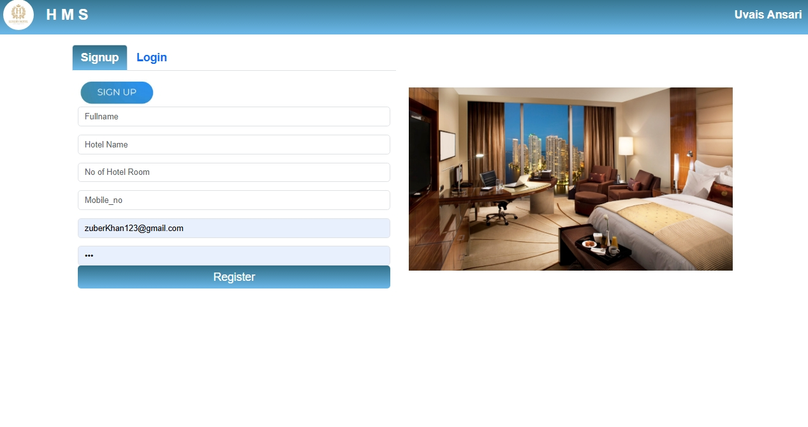
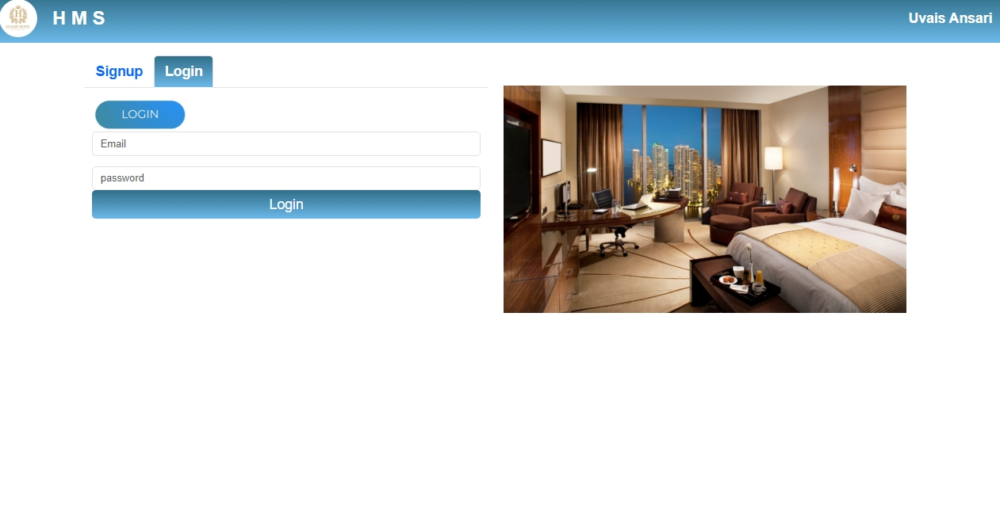
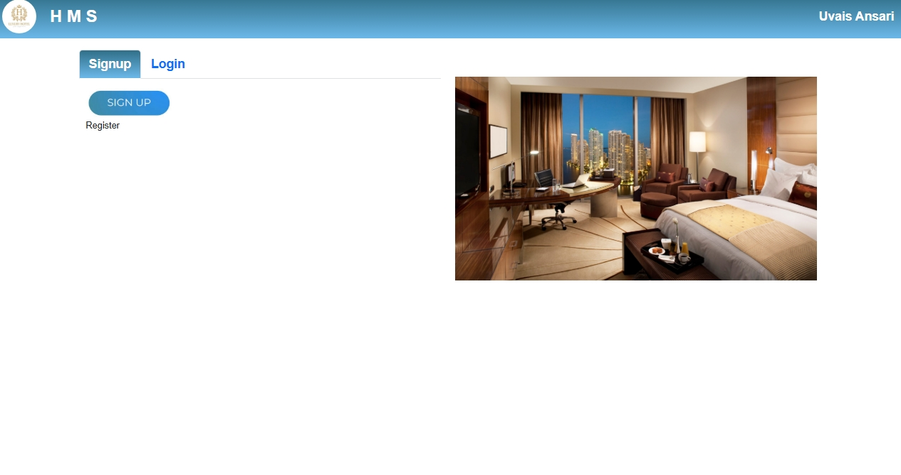
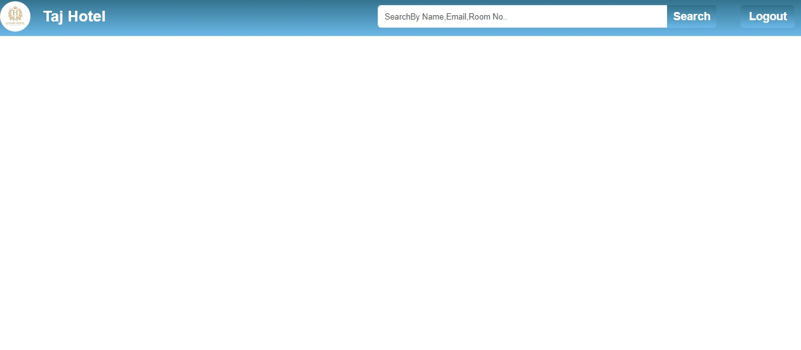
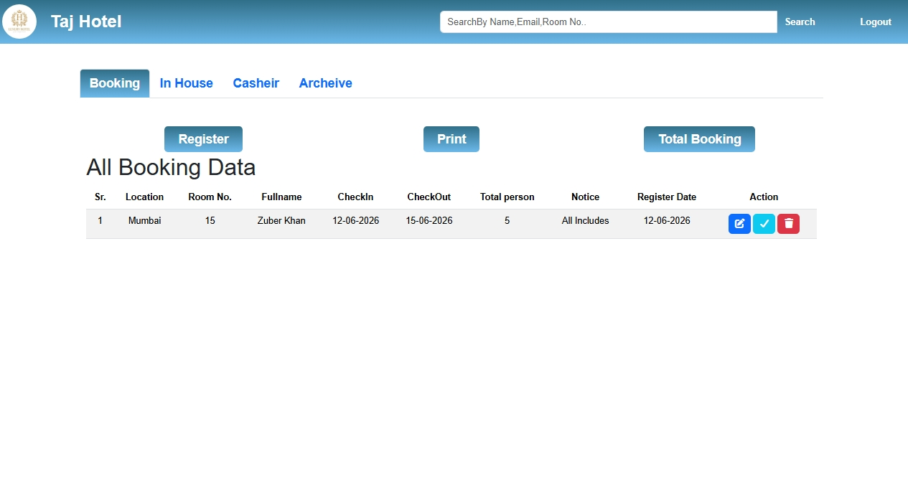
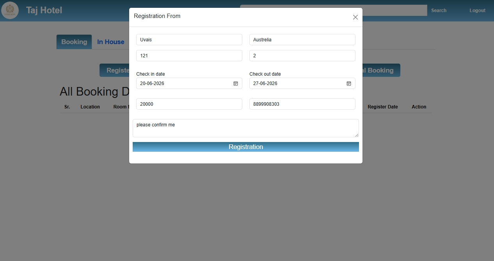
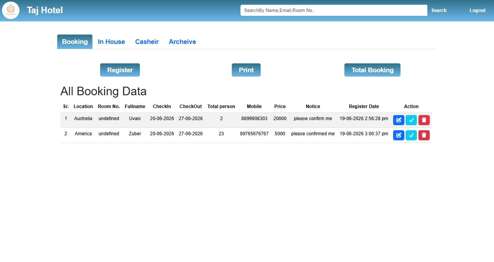

🏨 Hotel Management System

"A modern and responsive Hotel Management System built using HTML, CSS, JavaScript, and Bootstrap. This project allows users to explore hotel services, register/login, view hotel rooms, and manage bookings with an attractive and user-friendly interface."

## started date  16/06/2026

✨ Features

- 🔐 User Registration & Login System
- 🏠 Attractive Home Page
- 🛏️ Room Listing & Details
- 👤 User Profile Page
- 📱 Fully Responsive Design
- 🎨 Smooth Animations
- 🔔 Beautiful Alert Messages
- 🚀 Fast and Easy Navigation
- 🌙 Modern UI/UX Design

🛠️ Tech Stack

- HTML5
- CSS3
- JavaScript (ES6)
- Bootstrap 5
- Font Awesome
- Animate.css
- SweetAlert

📂 Project Structure

HotelProject/
│── index.html
│── style.css
│── app.js
│── bootsrap.js
│── sweetalert.js
│── profile/
│   ├── profile.html
│   ├── profile.css
│   └── profile.js
│── assets/
│   ├── iscreenshorts/
│   └── icons/

         ## screenshorts
         
         
         
         
       

 

.jpeg)

